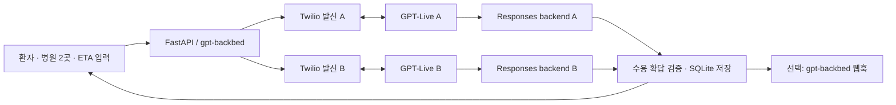

# BedLink — 응급실 동시 수용 확인

환자 상태·이름·나이·위치와 **병원 전화번호 2개 및 병원별 예상 도착 소요시간**을 입력하면, Twilio로 동시에 발신합니다. 각 통화에 독립적인 **GPT-Live (`gpt-live-1`)** 세션을 연결해 한국어로 환자 정보를 전달하고 담당자에게 환자별 수용 여부를 재확인합니다. 결과는 로컬 `gpt-backbed` 백엔드에 저장되고 화면에 표시됩니다. 별도 백엔드가 있으면 웹훅으로도 전달합니다.

main의 Next.js 브라우저 음성 테스트를 유지하면서 추가한 Python/FastAPI + SQLite 응급실 수용 확인 서비스입니다. 이 백엔드의 임시 화면은 Node.js 없이도 실행할 수 있습니다. Python 코드는 `backend/app/`에 있습니다.

## 바로 실행: 실제 전화 없는 데모

Python 3.11 이상이 필요합니다. 개발·검증 환경은 Python 3.14입니다.

```sh
python3 -m venv .venv
source .venv/bin/activate
pip install -r requirements-dev.txt
[ -f .env ] || cp .env.example .env
uvicorn app.main:app --app-dir backend --host 127.0.0.1 --port 8000 --no-access-log
```

[http://127.0.0.1:8000](http://127.0.0.1:8000)에 접속해 **예시 입력 → 두 병원 수용 확인 시뮬레이션**을 누릅니다. 첫 병원은 수용 가능, 두 번째 병원은 수용 불가로 응답하는 고정 시뮬레이션입니다. API나 전화망을 호출하지 않으며 화면과 결과에 데모임을 표시합니다.

```sh
pytest -q
```

## 실제 Twilio + GPT-Live 연결

`.env`에 다음을 설정한 후 서버를 다시 실행합니다.

| 설정 | 의미 |
|---|---|
| `APP_MODE=live` | 실제 발신 활성화 |
| `PUBLIC_BASE_URL=https://…` | 이 서버에 연결되는 공개 HTTPS **origin**. 경로·쿼리 없이 설정 |
| `OPERATOR_TOKEN` | 최소 24자 운영자 토큰. UI와 API 접근에 사용 |
| `OPENAI_API_KEY` | GPT-Live와 backend 모델 접근 권한이 있는 프로젝트 키 |
| `OPENAI_LIVE_MODEL=gpt-live-1` | 음성 모델 |
| `OPENAI_BACKEND_MODEL=gpt-6-luna` | GPT-Live Responses delegation으로 결과를 해석하는 모델 |
| `OPENAI_VOICE=marin` | 음성 |
| `TWILIO_ACCOUNT_SID` | Twilio 계정 SID |
| `TWILIO_AUTH_TOKEN` | REST 인증 및 웹훅 서명 검증 |
| `TWILIO_FROM_NUMBER` | Twilio 발신 가능 번호, E.164 형식 |
| `MAX_CALL_SECONDS=180` | 개별 통화 제한, 30~600초 |
| `DATABASE_PATH=data/dispatch.sqlite3` | SQLite 저장 경로 |
| `GPT_BACKBED_URL` | 선택 사항: 결과를 수신하는 HTTPS POST 엔드포인트 |
| `GPT_BACKBED_TOKEN` | 선택 사항: 결과 수신 서버의 Bearer 토큰 |

개발용 터널 예시는 `ngrok http 8000`입니다. 생성된 HTTPS origin을 `PUBLIC_BASE_URL`에 넣습니다. HTTPS와 WebSocket 업그레이드를 모두 이 앱으로 전달해야 합니다. Twilio 수신 전화번호의 webhook 설정은 필요하지 않습니다. 발신 REST 요청에서 통화별 TwiML/상태 콜백 URL을 지정합니다.

Twilio 계정에서 목적 국가로 발신할 수 있어야 하며, trial 계정은 수신 번호 인증 등 계정 제한이 적용될 수 있습니다. 먼저 **직접 관리하는 테스트 전화 두 대**로 검증하세요. 실제 모드에서는 요청 버튼을 누르는 즉시 입력 번호로 전화합니다. API 키는 브라우저에 전달하지 않습니다.

로컬 운영자 토큰 생성 예시:

```sh
python3 -c 'import secrets; print(secrets.token_urlsafe(32))'
```

`gpt-backbed`는 이 프로젝트의 결과 수집 역할 이름입니다. 별도의 기존 서비스/API 계약이 레포에 없어, 아래 웹훅 계약으로 연동 지점을 만들었습니다. OpenAI 모델 이름으로 사용하지 않습니다.

## 데이터 흐름



- Twilio `Connect/Stream`의 PCMU 8 kHz 음성을 GPT-Live의 `session.input_audio.append`로 전달하고 `session.output_audio.delta`를 전화로 재생합니다. 두 병원은 세션·통화 SID·프롬프트·발언·결과가 분리됩니다.
- GPT-Live는 `wss://api.openai.com/v1/live/sessions`에서 `session.start` → `session.started`로 연결합니다. 기존 Realtime API 이벤트와 혼용하지 않습니다.
- GPT-Live Responses delegation의 완료된 함수 호출(`response.output_item.done`)을 수집하고, 해당 응답 완료 후 `record_hospital_decision`을 실행합니다. 함수 결과는 `response.item.create`와 `response.create`로 되돌려 줍니다.
- 병원별 예상 도착시간은 **지금 출발하는 경우의 소요시간**입니다. 목적지 주소/지도 API가 없으므로 위치로 ETA를 추정하지 않습니다. 출발이나 이송을 확정하지 않습니다.
- 수용 가능/불가에는 환자·ETA 확인, 담당자 역할, 재확답, 병원 발언 인용이 필요합니다. 인용이 해당 병원의 입력 전사에 실제로 존재하는지도 검사합니다. 전사와 모델의 해석 오류 가능성까지 제거하는 검증은 아닙니다.
- 무응답, 통화 중, 실패, 끊김, 시간 초과, 모호하거나 조건부인 답변은 **`unknown`**입니다. 수용 불가로 추정하지 않습니다.
- 결과가 생기면 통화 마무리 시간을 5초 둔 뒤 종료합니다. 서버 종료 시 종료를 시도하고, 재시작 시 중단된 요청을 `unknown`으로 복구합니다. 종료 REST 요청 실패는 재시도하며 Twilio `TimeLimit`도 적용합니다.
- 운영자 요청의 `Idempotency-Key`는 중복 발신을 방지합니다. 같은 키에 다른 입력은 409입니다. Twilio REST 타임아웃은 발신 여부가 불명확하므로 자동 재발신하지 않습니다. 지연된 콜백이 도착하면 해당 통화를 종료합니다.

## API

`/api/dispatches` 이하에는 설정된 `Authorization: Bearer <OPERATOR_TOKEN>`이 필요합니다. `/api/config`는 키나 환자 정보 없이 모드만 공개합니다.

| 메서드 | 경로 | 동작 |
|---|---|---|
| POST | `/api/dispatches` | 요청 저장 후 202 반환, 두 병원 독립 발신. `Idempotency-Key` 필수 |
| GET | `/api/dispatches/{id}` | 병원별 상태·결과·전사 조회 |
| POST | `/api/dispatches/{id}/cancel` | 진행 통화 종료, 미확정 결과는 미확인 |
| POST | `/api/dispatches/{id}/retry-delivery` | 실패한 외부 웹훅 전송만 재시도. 재발신하지 않음 |
| POST | `/twilio/{id}/{hospital_id}/voice` | 서명 검증 후 통화별 TwiML |
| POST | `/twilio/{id}/{hospital_id}/status` | 서명 검증 후 통화 상태 반영 |
| WS | `/twilio/media` | Twilio 서명·계정·통화 SID·일회용 스트림 토큰 검증 |

입력 예시(데모 번호):

```json
{
  "patient": {
    "name": "테스트 환자",
    "age": 42,
    "condition": "넘어짐, 오른쪽 다리 통증. 의식 있음. 활력징후 미확인.",
    "location": "서울시 중구 시청 앞"
  },
  "hospitals": [
    {"name": "가상 응급실 A", "phone": "02-000-0001", "eta_minutes": 15},
    {"name": "가상 응급실 B", "phone": "02-000-0002", "eta_minutes": 20}
  ]
}
```

한국 전화번호는 `+82` 형식으로 정규화합니다. 전화번호가 같은 두 병원, 누락된 ETA, 잘못된 나이는 422로 거절합니다.

단일 전화기 통합 테스트에는 `hospitals`를 한 개만 전달할 수 있습니다. API는 1~2개를 허용하며, 임시 프론트 입력 폼은 두 병원용입니다.

병원 결과 예시:

```json
{
  "availability": "accepted",
  "reason": "담당자가 해당 환자의 도착 시 수용 가능을 재확인함",
  "evidence_quote": "네, 말씀하신 환자를 수용할 수 있습니다.",
  "respondent": "응급실 담당 간호사",
  "explicit_confirmation": true,
  "patient_context_confirmed": true,
  "confirmed_at": "2026-10-09T03:00:00+00:00",
  "event_id": "uuid"
}
```

## 외부 gpt-backbed 웹훅 계약

각 병원 결과가 확정될 때 각각 POST합니다. 둘 다 끝날 때까지 기다리지 않습니다. DB 저장은 항상 먼저 수행하며, 전송 실패가 수용 결과를 바꾸지 않습니다.

```json
{
  "event": "hospital.availability.resolved",
  "event_id": "uuid",
  "dispatch_id": "uuid",
  "hospital_id": "uuid",
  "mode": "live",
  "patient": {"name": "...", "age": 42, "condition": "...", "location": "..."},
  "hospital": {"name": "...", "phone": "+82...", "eta_minutes": 15},
  "call_sid": "CA...",
  "live_session_id": "...",
  "result": {"availability": "accepted", "reason": "...", "evidence_quote": "...", "respondent": "...", "explicit_confirmation": true, "patient_context_confirmed": true, "confirmed_at": "...", "event_id": "uuid"}
}
```

수신 서버는 영구 저장한 뒤 2xx로 응답해야 합니다. 헤더 `Idempotency-Key`와 본문 `event_id`는 재시도 간 유지됩니다. 전송은 at-least-once이므로 수신 서버에서 중복을 제거해야 합니다. 실패 시 지수 간격으로 최대 5번 시도하고, 실패 상태를 화면에 표시합니다. 데모는 외부 웹훅도 호출하지 않습니다.

## 구성 및 검증 범위

```text
app/main.py       API, 운영자 인증, Twilio 검증
app/service.py    동시 발신, 상태 관리, 데모, 웹훅 재시도
app/live.py       GPT-Live 음성 중계, 한국어 대화/백엔드 지침
app/telephony.py  Twilio Calls REST 및 TwiML
app/models.py     입력 및 수용 결과 검증
app/store.py      SQLite 저장
static/          한국어 대시보드
tests/           API·통화·음성 프로토콜 통합 테스트
```

테스트는 외부 전화를 걸지 않고 Twilio/OpenAI transport를 대체합니다. 병렬 발신, 부분 실패, 취소 경합, 결과별 격리, 확답 검증, 서명 검증, 중복 방지, SQLite 복구, 웹훅 재시도 및 양방향 음성 이벤트를 검사합니다. 실제 통화 음질, 한국어 인식, 모델 접근 권한, 병원의 자동응답/내선 연결은 실제 계정·테스트 수신 번호로 별도 검증해야 합니다. 현재 구현은 IVR 메뉴를 자동 탐색하지 않습니다.

현재는 **단일 프로세스 MVP**입니다. `--workers 1`(기본값)로 실행하고 live에서는 `--reload`를 사용하지 마세요. 통화 중 reload는 세션을 끊습니다. 활성 작업과 음성 소켓은 메모리에 있으므로 다중 worker/다중 인스턴스 확장에는 공유 큐·락·세션 라우팅이 필요합니다. 동시 요청은 최대 5개(10통)입니다.

SQLite에 환자 정보·전사·결과가 평문 저장됩니다. 녹음 파일은 저장하지 않으며 GPT-Live `store`는 false입니다. 실제 운영 전 저장 볼륨 보호, 역할별 접근, 보존/삭제 정책 및 대상 병원과의 업무 절차를 갖추어야 합니다. 공개 터널에서 demo를 운영한다면 `OPERATOR_TOKEN`을 설정하세요. 운영자 토큰은 브라우저 메모리에만 두고 저장하지 않습니다.

## 공식 프로토콜 문서

- [OpenAI GPT-Live WebSockets](https://developers.openai.com/api/docs/guides/voice-websockets)
- [GPT-Live delegation 및 함수 결과 전달](https://developers.openai.com/api/docs/guides/live-delegation)
- [GPT-Live 세션·전사·종료](https://developers.openai.com/api/docs/guides/live-conversations)
- [Twilio Calls API](https://www.twilio.com/docs/voice/api/call-resource)
- [Twilio Media Streams 메시지](https://www.twilio.com/docs/voice/media-streams/websocket-messages)
- [Twilio 요청 서명 검증](https://www.twilio.com/docs/usage/security)
